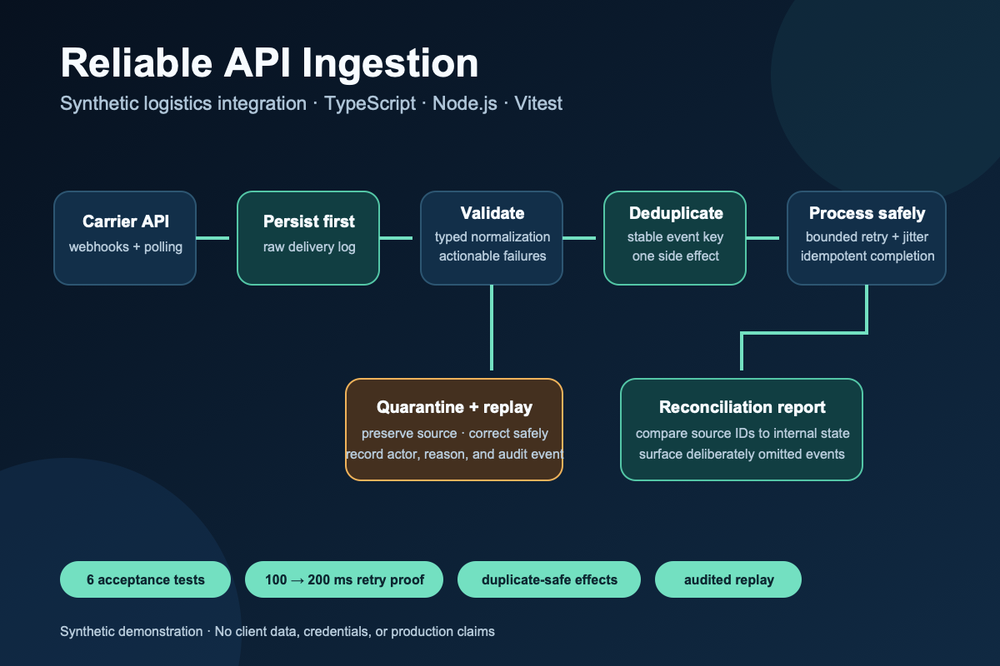
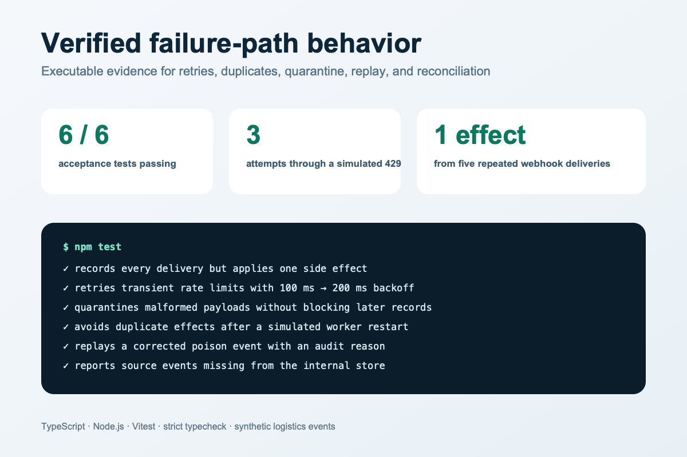

# Reliable API ingestion in TypeScript

**Status:** implemented synthetic demonstration.

A synthetic logistics-events integration that demonstrates how to move data reliably between a rate-limited external API and an internal operational store.



## Scenario

A carrier API publishes shipment updates through a mixture of webhooks and paginated polling. Events may arrive late, more than once, out of order, or with invalid fields. Operators need a trustworthy view of processing and a safe replay path.

## Demonstrated outcome

- Verify and persist incoming events before processing.
- Deduplicate side effects with a stable idempotency key.
- Normalize valid events into a typed domain model.
- Quarantine permanent failures with actionable context.
- Retry transient failures with bounded exponential backoff and jitter.
- Reconcile polling checkpoints against received webhooks.
- Let an operator replay a quarantined event without creating duplicates.



## Implemented stack

TypeScript, Node.js, Vitest, and an in-memory persistence adapter that keeps the reliability behavior executable without external credentials or infrastructure. The storage and processor boundaries are deliberately explicit so PostgreSQL and a production queue can replace the demo adapters.

## Acceptance scenarios

1. Repeating the same webhook five times creates one business event and records all delivery attempts.
2. A rate-limit response backs off and later succeeds without manual action.
3. A malformed payload is quarantined and never blocks later records.
4. Restarting a worker after persistence but before completion does not duplicate the side effect.
5. An operator corrects and replays a poison event with an auditable reason.
6. A reconciliation report exposes a deliberately omitted source event.

## Run it

```bash
npm install
npm run typecheck
npm test
npm run demo
```

The demo prints processed, duplicate, quarantined, retry, reconciliation, and audit outcomes as structured JSON.

## Repository shape

```text
src/validation.ts  runtime validation and normalization
src/store.ts       persistence boundary and audit records
src/processor.ts   bounded retry policy and failure classification
src/ingestion.ts   deduplication, quarantine, replay, and reconciliation
src/demo.ts        executable structured-output scenario
test/              six acceptance-scenario tests
```

## Non-goals

No real carrier credentials or data, financial reconciliation, multi-region guarantees, or production SLA. All names and records are synthetic.

## License

[MIT](LICENSE)
